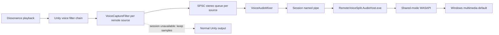

# Audio Routing Architecture

This design depends on [Lethal Company voice playback](../domain/lethal-company-voice-playback.md),
[OBS process audio capture](../domain/obs-process-audio-capture.md), and the
[Windows Core Audio contract](../domain/windows-core-audio.md). Host launch
also depends on [Windows process creation](../domain/windows-process-creation.md).

## Invariants

- The local player's voice source is never registered.
- Each remote source has one single-producer, single-consumer stereo queue.
- Unity samples are cleared only after a complete callback block is committed
  to a verified ready session.
- The audio host must be neither the game process nor its descendant.
- Host launch, handshake, transport, ancestry, endpoint, or render failure
  restores normal Unity voice output.
- The Unity audio callback performs no COM calls, reflection, process
  enumeration, allocation, or logging.

## Data path

The game-side writer mixes all registered sources into fixed ten-millisecond
float-stereo blocks. Mono input is duplicated; multichannel input uses the
first two channels. Each source queue accepts a complete callback or rejects it
atomically. The final mix is clamped to `[-1, 1]`.

The pipe name combines the game PID and a cryptographically random session
identifier. The handshake validates protocol magic, version, sample rate,
channel count, and the returned host PID before any routing epoch becomes
ready. Each side also asks Windows for the actual named-pipe peer PID and
requires it to match the claimed game or host process. The plugin then requires
the server process image to equal the packaged host path. Audio frames carry a
bounded sample count followed by raw little-endian single-precision samples. A
zero-length frame is a heartbeat.

## Process separation

Launching the host as a direct child of Lethal Company would let an OBS capture
of the game include the host's audio. The plugin therefore identifies the
interactive Windows Explorer shell, verifies its image path, and uses native
extended process creation to make that shell the host's parent. This avoids
managed COM activation, which is not available in the target Unity Mono
runtime.

The launch result is not trusted as proof. The host returns its PID during the
named-pipe handshake. The plugin requires the returned PID to equal the actual
pipe server, requires the server image to equal the packaged host path, then
snapshots the process tree and rejects the session when the host is the game or
one of its descendants.

The host window is minimized and titled
`Lethal Company Remote Voice Split`. Closing the window closes the pipe and
immediately retires game-side readiness.

## Concurrency and lifecycle

The Unity audio thread is each queue's producer. One plugin writer thread is
their consumer and the pipe producer. One host session thread reads frames
into a bounded queue, and one host render thread consumes that queue for
WASAPI.

Registration retirement and routing-epoch retirement wait for in-flight
submissions before clearing queues. A stale callback can therefore neither
clear a new Unity block nor publish into a replacement session. Transport
backlog is discarded rather than replayed after recovery.

The host opens the current Windows multimedia default endpoint and publishes
ready only after `IAudioClient.Start` succeeds. A default-endpoint change,
device error, host close, protocol error, or game exit terminates that session.
The plugin retries launch after a bounded delay. Until a replacement session
is fully verified, later callbacks remain on Unity output.

This fail-open policy prioritizes audible communication over perfect
separation during transitions. One transition block can be duplicated or
dropped, but sustained silence and stale replay are forbidden.

The deterministic harness exercises readiness retirement while an audio
callback is active, rejection while unavailable, and activation of a new
epoch after recovery. Its optional live-audio suite additionally:

- starts the production WASAPI pump and injects a changed multimedia endpoint
  ID through its internal endpoint provider;
- verifies that the production failure callback retires destructive routing;
- starts a replacement renderer on the current endpoint;
- launches the production host with Windows Explorer as its verified parent
  and checks that it is outside the test process tree;
- closes a real audio-host pipe and checks normal process exit; and
- kills a real audio-host process, observes the broken pipe, and completes a
  new host handshake.

The endpoint test does not change the user's Windows setting. It drives the
same comparison and failure path used by a real default-device change.
