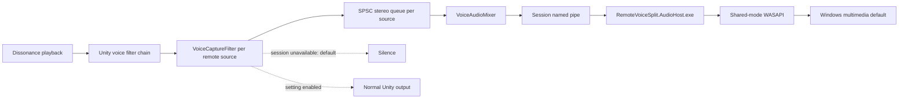

# Audio Routing Architecture

This design depends on [Lethal Company voice playback](../domain/lethal-company-voice-playback.md),
[BepInEx and Unity lifecycle](../domain/bepinex-unity-lifecycle.md),
[BepInEx configuration](../domain/bepinex-configuration.md),
[OBS process audio capture](../domain/obs-process-audio-capture.md), and the
[Windows Core Audio contract](../domain/windows-core-audio.md). Host launch
also depends on [Windows process creation](../domain/windows-process-creation.md).

## Invariants

- The local player's voice source is never registered.
- Each remote source has one single-producer, single-consumer stereo queue.
- Unity samples are cleared after a complete callback block is committed to a
  verified ready session.
- When a callback cannot enter a verified session, Unity samples are cleared by
  default. The fallback setting can preserve them instead.
- The audio host must be neither the game process nor its descendant.
- Host launch, handshake, transport, ancestry, endpoint, or render failure
  silences remote voice by default.
- The Unity audio callback performs no COM calls, reflection, process
  enumeration, allocation, or logging.

## Data path

The game-side writer mixes all registered sources into fixed ten-millisecond
float-stereo blocks. Mono input is duplicated; multichannel input uses the
first two channels. Each source queue accepts a complete callback or rejects it
atomically. The final mix is clamped to `[-1, 1]`.

`Audio.FallbackToGameOutput` defaults to `false`. A BepInEx setting-change
notification updates one atomic integer shared by the process sender and Unity
audio callbacks. The callback therefore applies the new policy to its next
voice block without reattaching sources or restarting either process.

When submission is unavailable or a source queue rejects a block, the default
policy discards queued samples and clears the Unity block. With the setting
enabled, an unavailable block remains on Unity output. A successfully submitted
block is always cleared from Unity. The mod does not watch external edits to
the configuration file.

The pipe name combines the game PID and a cryptographically random session
identifier. The handshake validates protocol magic, version, sample rate,
channel count, and the returned host PID before any routing epoch becomes
ready. Each side also asks Windows for the actual named-pipe peer PID and
requires it to match the claimed game or host process. The plugin then requires
the server process image to equal the packaged host path. Audio frames carry a
bounded sample count followed by raw little-endian single-precision samples. A
zero-length frame is a heartbeat.

## Process separation

Launching the host as a direct child of Lethal Company would let an OBS capture
of the game include the host's audio. The plugin therefore identifies the
interactive Windows Explorer shell, verifies its image path, and uses native
extended process creation to make that shell the host's parent. This avoids
managed COM activation, which is not available in the target Unity Mono
runtime.

The launch result is not trusted as proof. The host returns its PID during the
named-pipe handshake. The plugin requires the returned PID to equal the actual
pipe server, requires the server image to equal the packaged host path, then
snapshots the process tree and rejects the session when the host is the game or
one of its descendants.

The host window is minimized and titled
`Lethal Company Remote Voice Split`. Closing the window closes the pipe and
immediately retires game-side readiness.

The host process and window have game-process lifetime rather than connection
lifetime. A pipe break, render failure, or default-endpoint change retires
routing and applies the configured unavailable-host policy, but the host keeps
the same PID and waits for the plugin to reconnect. The replacement session
revalidates the pipe peer, host image, and ancestry before it becomes ready. If
the plugin does not reconnect immediately, the host keeps the OBS window
available until the verified game process exits. The initial unconnected
launch still has a bounded timeout so a failed startup does not leave a host
behind.

## Concurrency and lifecycle

The Unity audio thread is each queue's producer. One plugin writer thread is
their consumer and the pipe producer. One host session thread reads frames
into a bounded queue, and one host render thread consumes that queue for
WASAPI.

The writer, Harmony patch, and integration context have game-process lifetime,
not BepInEx component lifetime. Destroying the loader-owned plugin component
does not retire routing. A static Unity application-quit subscription owns
normal cleanup; an abrupt game-process exit owns crash cleanup.

Registration retirement and routing-epoch retirement wait for in-flight
submissions before clearing queues. A stale callback can therefore neither
clear a new Unity block nor publish into a replacement session. Transport
backlog is discarded rather than replayed after recovery.

The host opens the current Windows multimedia default endpoint and publishes
ready only after `IAudioClient.Start` succeeds. A default-endpoint change,
device error, or protocol error terminates only the current connection session.
The plugin reconnects to the same host process after a bounded delay. A host
close or crash permits a replacement process; game exit terminates the host.
Until a replacement session is fully verified, later callbacks are silent by
default or remain on Unity output when the fallback setting is enabled.

The default fail-closed policy prioritizes strict recording-track separation
and can make remote communication inaudible during a host failure. The opt-out
fail-open policy prioritizes audible communication but can place remote voice
in the game-audio track. Queued data is discarded on failure under either
policy, so recovery does not replay stale voice. A session can still fail after
accepting one transition block, causing that block to be dropped under either
policy.

The deterministic harness exercises readiness retirement while an audio
callback is active, default-silent and opt-out decisions while unavailable,
and activation of a new epoch after recovery. Its optional live-audio suite
additionally:

- starts the production WASAPI pump and injects a changed multimedia endpoint
  ID through its internal endpoint provider;
- verifies that the production failure callback retires destructive routing;
- starts a replacement renderer on the current endpoint;
- launches the production host with Windows Explorer as its verified parent
  and checks that it is outside the test process tree;
- closes a real audio-host pipe, verifies that the OBS-facing PID survives,
  and reconnects to that same process; and
- kills a real audio-host process, observes the broken pipe, and completes a
  new host handshake.

The endpoint test does not change the user's Windows setting. It drives the
same comparison and failure path used by a real default-device change.
